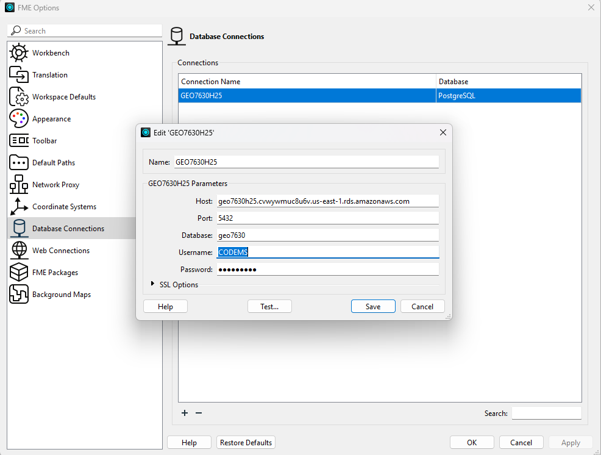

# Examen #1 - GEO7630H25
 
##  Date & Heure
**25 février 2024** - 🕠 **17h30**  
**Salle A-4160** - **UQAM**  
**Chargé de cours** : Clément Glogowski  
 
---
 
## **Première Partie - Examen Théorique**
L’examen théorique se déroule via un **formulaire en ligne**.  
**⚠️ Ce formulaire doit être complété pendant la période de l’examen et remis avant 20h30 (la réponse sera postdatée)**
 
🔗 **Accès au formulaire :**  
👉 [Formulaire d'examen (Google Forms)](https://docs.google.com/forms/d/e/1FAIpQLSfz30rCQ7wUpP9Y4IUTsom7hUdeFqnoIqoijdfUjQ2nkopy5g/viewform?usp=sharing)
 
---
 
## 🛠 **Deuxième Partie - Micro TP FME**
Vous devrez **Créer une couche d’index H3** représentant la quantité de commerces vacants dans chacun des hexagones.
 
### **📥 Données entrantes**
 
1️⃣ **Couches des commerces (GeoJSON)**  
🔗 [Occupation commerciale 2024 - Montréal](https://donnees.montreal.ca/fr/dataset/f8582c4d-a933-4306-bb27-d883e13dd207/resource/6d874afd-f053-4a9a-8bbd-703b9bddb8d3/download/occupation-commerciale-2024.geojson)
 
2️⃣ **Limites terrestres (GeoJSON) pour créer les hexagones**  
🔗 [Limites terrestres - Montréal](https://data.montreal.ca/dataset/b628f1da-9dc3-4bb1-9875-1470f891afb1/resource/92cb062a-11be-4222-9ea5-867e7e64c5ff/download/limites-terrestres.geojson)
 
---
 
## **🔍 Requis du TP**
✅ **Filtrer les commerces vacants** sur la propriété `VACANT`.

✅ **Créer des points à partir des données filtrées avec VertexCreator**

✅ **Créer des hexagones H3** de **résolution 9** (segments de **0,2 km**).

✅ **Écrire les hexagones dans la base de données PostgreSQL/PostGIS**.

✅ **Créer une carte QGIS, choisir la symbologie désirée et faire un screenshot de votre carte et me l'envoyer par courriel à : glogowski.clement@uqam.ca**

⚠️ **Indice 1:** Le polygone contenant le plus de commerces vacants en possède **70**.

---
 
## 🗄 **Connexion à la base de données**
Votre **Writer PostgreSQL** devra enregistrer les hexagones dans la base de données suivante :
 

| **Paramètre** | **Valeur** |
|--------------|-----------|
| **Nom de la base** | `GEO7630H25` |
| **Host** | `geo7630h25.cvwywmuc8u6v.us-east-1.rds.amazonaws.com` |
| **Port** | `5432` |
| **Database** | `geo7630` |
| **Username** | `VOTRECODEMS` |
| **Password** | `VOTRECODEMS` |
| **Nom du Schéma** | `VOTRECODEMS` |
| **Nom de la Table** | `VOTRECODEMS_EXAM1` |
 
📌 **⚠️ Table qualifier :** `VOTRECODEMS`
 
---

 ⚠️ **Information utile:** Si vous ne trouvez pas 70, ou n'arrivez pas à finir le workbench envoyez le moi par courriel à glogowski.clement@uqam.ca.

## 🛑 **Pièges et conseils**
⚠ **Attention aux erreurs classiques :**  
🔹 Vérifiez / reprojetez vos données correctement (indice : comme la projection des hexagones)
🔹 Assurez-vous que votre **connexion PostgreSQL** fonctionne avant la fin de l’examen.  
🔹 Vérifiez vos **résultats** : le nombre d’hexagones et de commerces vacants doit être **cohérent** avec les données en entrées.
 
---
 
🚀 **Bonne chance à tous !**