# 📚 GEO 7630 - Laboratoire 2 : Jointure et traitement des données géospatiales
s
## 🎯 Objectif du laboratoire
Ce deuxième laboratoire vise à approfondir vos compétences dans **FME** et **QGIS**. Vous apprendrez à manipuler des données géospatiales plus complexes en combinant des données vectorielles et matricielles, et à réaliser une jointure spatiale pour répondre à une problématique simple.

**Problématique** : Identifier la répartition des arbres par quartier dans la ville de Montréal.

---

## 📝 Tâches à réaliser

### **1. Prérequis**
Assurez-vous d'avoir :
- **FME Desktop** installé et fonctionnel.
- **QGIS** installé.
- Un compte GitHub avec un dépôt existant (`geo7630-lab2`).
- Accès à la base de données PostgreSQL (Amazon RDS) fournie en classe.

**Jeux de données requis**:
- **Arbres** : [Données ponctuelles (CSV)](https://donnees.montreal.ca/dataset/b89fd27d-4b49-461b-8e54-fa2b34a628c4/resource/64e28fe6-ef37-437a-972d-d1d3f1f7d891/download/arbres-publics.csv) 
- **Quartiers** : Polygones (GeoJSON). [Polygones (GeoJSON)](https://donnees.montreal.ca/dataset/9797a946-9da8-41ec-8815-f6b276dec7e9/resource/6b313375-d9bc-4dc3-af8e-ceae3762ae6e/download/limites-administratives-agglomeration-nad83.geojson) 

---

### **2. Lire les données sources dans FME**
1. **Ouvrez FME Workbench** et créez un nouveau projet.
2. **Ajoutez un Reader CSV** pour les données des arbres :
   - Source : URL du fichier CSV.

   

   - Vérifiez que les champs **latitude** et **longitude** sont reconnus correctement.
3. **Ajoutez un Reader GeoJSON** pour les quartiers :
   - Source : URL du fichier GeoJSON.

   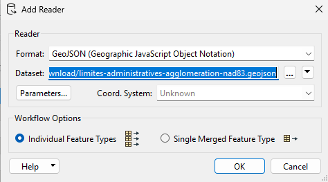

#### **Validation** :
- Utilisez **Feature Caching** pour inspecter vos données avec l’Inspecteur FME.
- Assurez-vous que les géométries sont valides et que les attributs sont chargés correctement.
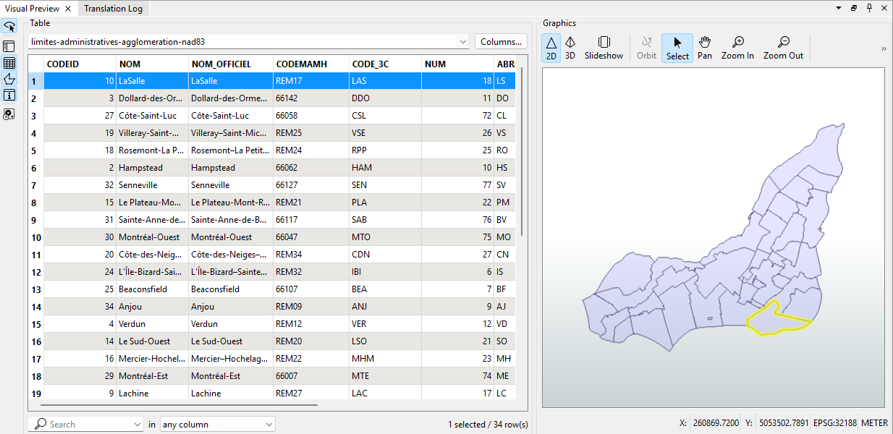
---

### **3. Reprojeter les données**
- Utilisez le **Reprojector** pour projeter les deux jeux de données en EPSG:32188 MTM8.

`Reprojeter en **MTM8 (EPSG:32188)** garantit l’alignement des couches SIG, améliore la précision des analyses locales et minimise les distorsions. Ce système est adapté aux régions spécifiques comme le Québec, respectant les standards géospatiaux locaux.`

- Validez que les couches ont la même projection.

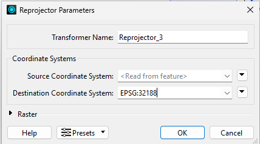

- Vous devriez avoir quelquechose comme ca :

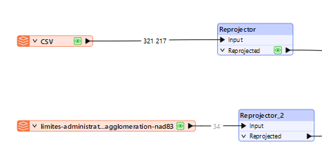
---

### **4. Jointure spatiale**

`Une **jointure spatiale** associe des données de deux couches SIG en fonction de leur relation géographique (intersection, contenance, proximité). Elle permet d'enrichir les données en liant attributs et géométries selon leur emplacement spatial.`

1. **Effectuez une jointure spatiale** pour compter le nombre d'arbres par quartier :
   - Utilisez le **PointOnAreaOverlayer** pour associer chaque point (arbre) à un polygone (quartier).
   - Calculez la somme des arbres dans chaque quartier.

   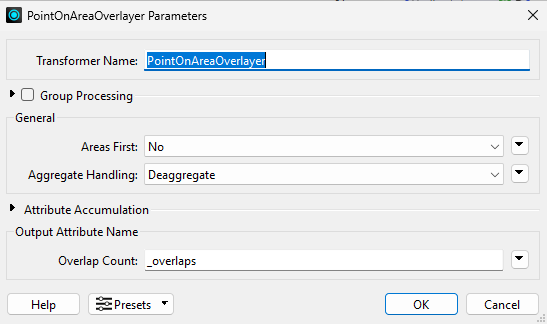

2. **Nettoyez les attributs** :
   - Gardez uniquement les attributs pertinents (ex. `nom_quartier`, `nombre_arbres`).
   - Utilisez le **AttributeKeeper** pour filtrer les colonnes inutiles.

   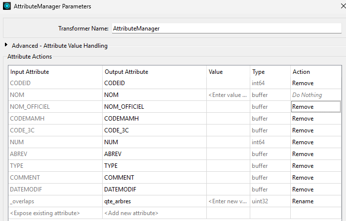

---

### **5. Calcul d'une statistique supplémentaire**
- Ajoutez une colonne avec la **densité d'arbres** par quartier :
   - Utilisez le **AttributeCreator** pour créer un champ `densite_arbres`.
   - Formule : `nombre_arbres / superficie_quartier` (en hectares).

   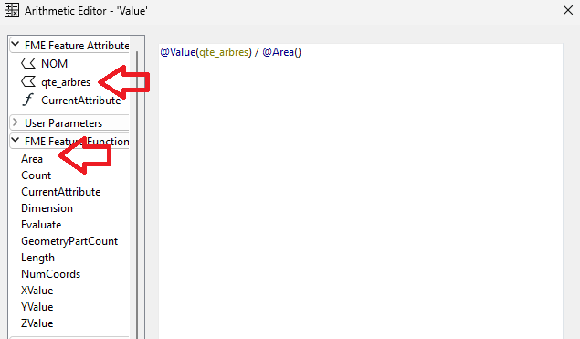

   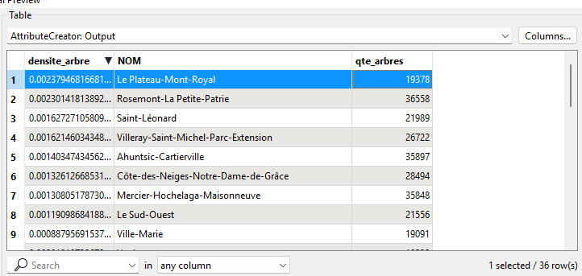

---

### **6. Écrire les données dans PostgreSQL**
1. Ajoutez un **Writer PostgreSQL** pour exporter le résultat dans la base de données :
   - Schéma : Utilisez votre code MS comme nom de schéma.
   - Nom de la table : `densite_arbres_quartiers`.
2. **Paramètres du Writer** :
   - **Table Qualifier** : Votre code MS.
   - **Mode d’écriture** : `Drop and Create`.
   - **Spatial Type** : Geometry.

---

### **7. Visualiser les données dans QGIS**
1. Connectez-vous à votre base de données PostgreSQL depuis **QGIS**.
2. Chargez la table **densite_arbres_quartiers**.

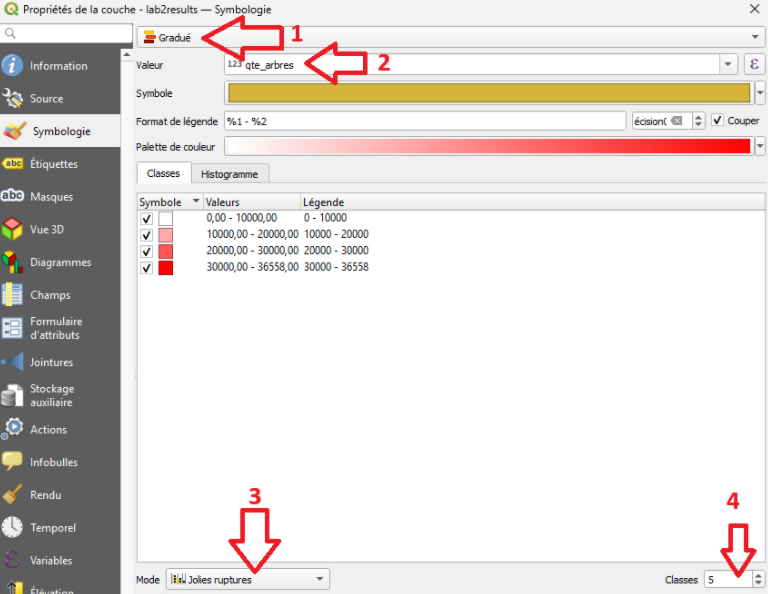

3. Appliquez une symbologie :
   - Utilisez un **gradient de couleurs** pour représenter la densité d'arbres.
   - Créez une carte simple et compréhensible.

   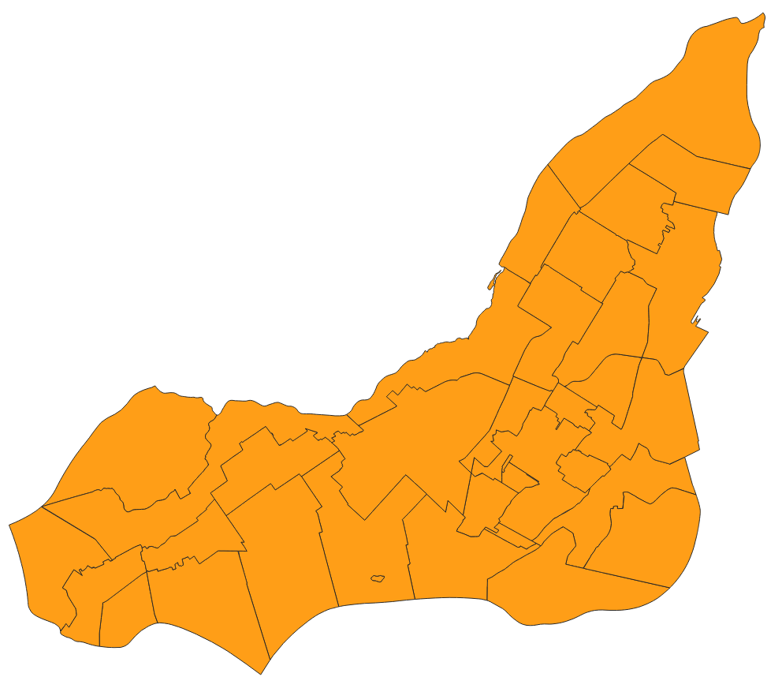

   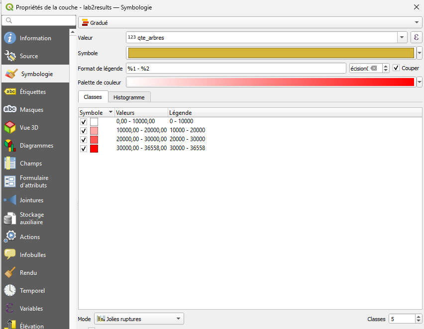

4. Exportez le style pour le sauvegarder dans votre base de données

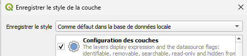

---

## 📝 Matériel à remettre
1. **Table dans le schema de la BD** 
2. **Capture d’écran QGIS** montrant la carte finale avec la densité d'arbres par quartier.
3. **Style `.sld` exporté** pour la couche dans PostgreSQL.

---

## 🚀 Conseils pour réussir
1. **Validez chaque étape** dans FME avec **Feature Caching**.
2. **Soignez votre symbologie** dans QGIS pour qu’elle soit compréhensible.
3. **Testez votre connexion PostgreSQL** pour éviter les erreurs à l’exportation.
4. Documentez clairement vos étapes dans le **README.md**.

---

## 📂 Ressources utiles
- **FME Documentation** : [FME Docs](https://docs.safe.com/)
- **QGIS Documentation** : [QGIS Docs](https://qgis.org/en/docs/)
- **PostGIS Documentation** : [PostGIS Docs](https://postgis.net/documentation/)
- **Markdown Guide** : [Guide Markdown](https://www.markdownguide.org/)

---

**Bon laboratoire et bonne exploration des données !** 🚀
