# 🌳 **Laboratoire 3 : Optimisation de la densité d’implantation d’arbres dans les parcs de Montréal** *(problématique fictive)*

Optimiser la densité d’implantation d’arbres dans les parcs de Montréal (problématique factice)

## 📋 **Déroulement et explications**
Chaque laboratoire s'articule autour d'un thème et d'une problématique spécifique. Vous devrez résoudre cette problématique en utilisant les logiciels requis.

## Déroulement et explications

Chaque laboratoire aura un thème, une problématique particulière, il faudra résoudre la problématique avec les logiciels demandé

## Problématique à résoudre

Optimiser la densité d’implantation d’arbres dans les parcs de Montréal

---

## 📋 **Déroulement et explications**
Chaque laboratoire s'articule autour d'un thème et d'une problématique spécifique. Vous devrez résoudre cette problématique en utilisant les logiciels requis.

---

## ❓ **Problématique à résoudre**
Optimiser la densité d’implantation d’arbres dans les parcs de Montréal.

---

## 🔧 **Outils nécessaires**
- **QGIS**
- **FME**

---

## 🌟 **Analyse de la densité arboricole par parc**

### 📝 **Étape 1 : Acquisition des données**
**Pourquoi ?**  

👉 Les données sources doivent être téléchargées depuis une plateforme fiable pour garantir leur exactitude. Elles constituent la base de toute l'analyse.

1. Accéder au [portail des données ouvertes de Montréal](https://donnees.montreal.ca/).
2. Identifier les fichiers suivants :
   - 🌲 **Arbres (points)** : fichier CSV.
   - 🏞️ **Parcs (polygones)** : fichier GeoJSON.
3. Copier les URLs des données pour une utilisation dans FME.

---

### 📂 **Étape 2 : Chargement des données dans FME**
**Pourquoi ?**  
👉 FME permet de charger, transformer et traiter efficacement des données provenant de diverses sources. En travaillant directement avec des URLs, vous automatisez le flux de travail et réduisez les erreurs manuelles.

1. Ouvrir FME et créer un **Workbench** vide.
2. Ajouter un **Reader CSV** pour les données des arbres :
   - Sélectionner l’option **URL**.
3. Ajouter un **Reader GeoJSON** pour les données des parcs :
   - Sélectionner également l’option **URL**.

   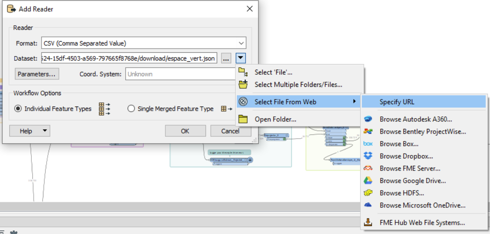

4. Valider que les données sont chargées correctement avec l’option JUST RUN THIS.

   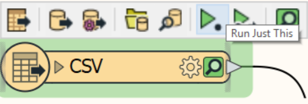

5. Assurez vous que l’option ENABLE FEATURE CACHING soit bien activée
    Cette option permet de charger en mémoire les données et de ne pas les retélécharger à chaque "run"

   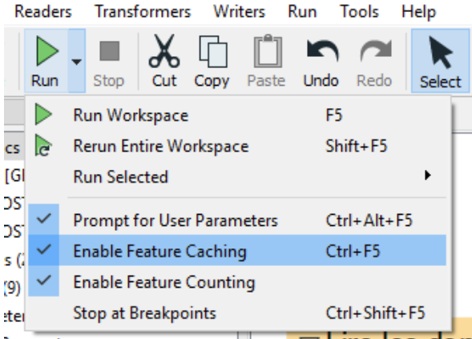

6. Vous allez ensuite pouvoir inspecter vos données avec l’inspecteur (icône de loupe ou d’oeil)

    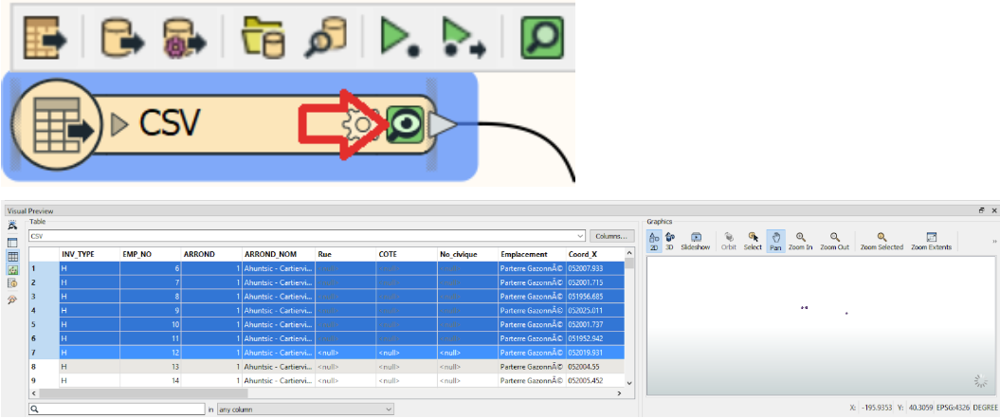

---
 

---

### 🌍 **Étape 3 : Reprojection des données**
**Pourquoi ?**  
👉 Les systèmes de coordonnées standardisés (comme EPSG:32188) permettent d'assurer l'alignement des couches et la précision des mesures dans les analyses géospatiales.

1. Reprojeter les couches de données (arbres et parcs) en **EPSG:32188**.
2. Utiliser le transformer **Reprojector** dans FME.

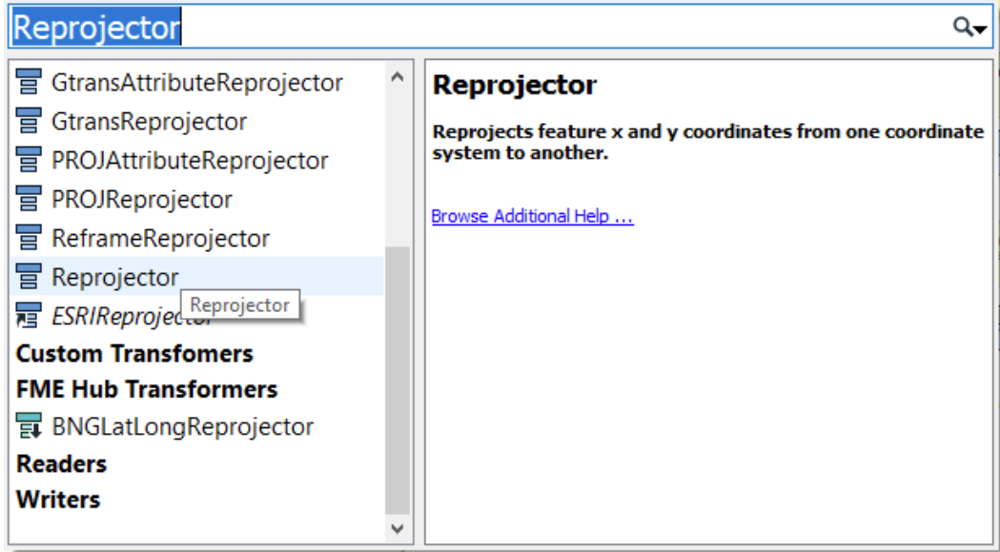

---

### 🤝 **Étape 4 : Jointure spatiale**
**Pourquoi ?**  
👉 La jointure spatiale permet de relier les données des arbres à leurs parcs respectifs en fonction de leur position géographique. C’est une étape clé pour obtenir une analyse cohérente.

1. Effectuer une jointure spatiale pour associer chaque arbre à un parc.
2. Utiliser le transformer **PointOnAreaOverlayer**.

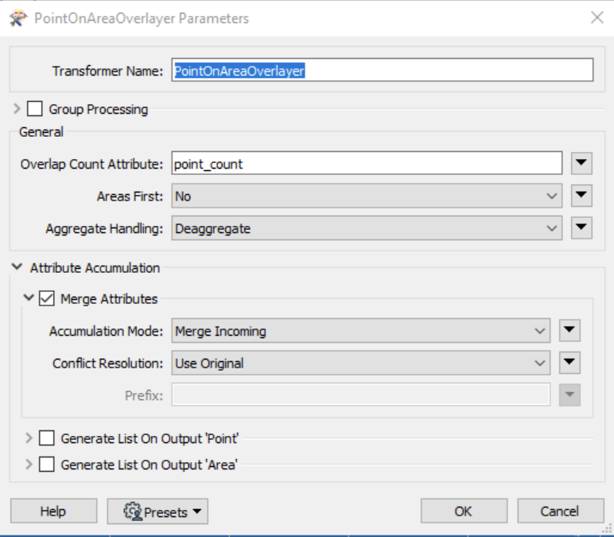

---

### 🧹 Étape 6 : Nettoyage et validation des données**

**Pourquoi ?**  
👉 Il faut s'assurer de publier les données de manière simple pour les usagers donc on retire et on nettoie les données pour les rendre acceptable à la lecture mais aussi supprimer les doublons, les entrées avec des latitudes longitudes nulles etc...
Sélectionner les attributs nécessaires :

1. Utilisez le transformer **ATTRIBUTEKEEPER** pour conserver uniquement les champs essentiels dans la nouvelle couche de données. Cela simplifie l’analyse et réduit la taille des données.

Ca pourrait aussi être un **AttributeManager** qui est à mon sens plus pratique et plus versatile

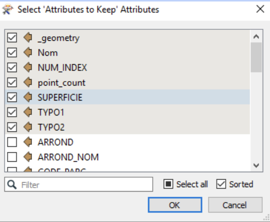

2. Gérer les erreurs avec un LOGGER :

Connectez une boîte de LOG aux "features rejetées" pour capturer et identifier les erreurs sans interrompre le processus.
Astuce : Cliquez droit sur la flèche grise de sortie Rejected pour ajouter le LOGGER.

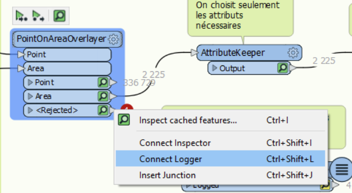

---
### 📊 **Étape 9 : Calcul de la médiane de densité**
**Pourquoi ?**  
👉 Calculer la médiane pour les variables **tree_count** et **tree_density** permet d’identifier les valeurs centrales et de mieux comprendre la répartition des arbres dans les parcs.

1. Ajouter un **StatisticsCalculator** au flux de travail.

2. Configurer les paramètres pour calculer la **médiane** des variables suivantes :  
   - **tree_count** (nombre d’arbres).  
   - **tree_density** (densité d’arbres).  

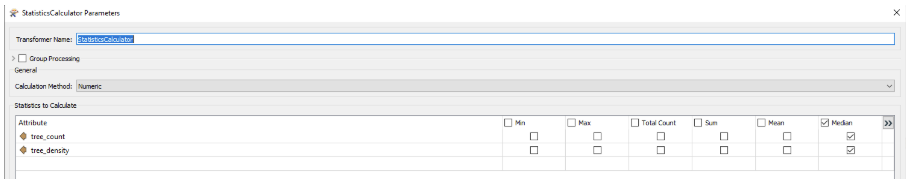

3. Vérifier les résultats en inspectant la sortie du transformer.

---
### 📊 **Étape 10 : Calcul de la médiane de densité**
**Pourquoi ?**  
👉 Calculer la médiane pour les variables **tree_count** et **tree_density** permet d’identifier les valeurs centrales et de mieux comprendre la répartition des arbres dans les parcs.

1. Ajouter un **StatisticsCalculator** au flux de travail.

2. Configurer les paramètres pour calculer la **médiane** des variables suivantes :  
   - **tree_count** (nombre d’arbres).  
   - **tree_density** (densité d’arbres).  

3. Vérifier les résultats en inspectant la sortie du transformer.

---

---
### 📊 **Étape 10 : Calcul de l’index par rapport à la moyenne**
**Pourquoi ?**  
👉 Calculer l’index par rapport à la moyenne permet de normaliser les données et d’identifier les parcs ayant une densité ou un nombre d’arbres significativement au-dessus ou en dessous de la moyenne.

1. Ajouter un **AttributeManager** au flux de travail.

2. Configurer une nouvelle formule pour calculer l’index :  
   - Exemple : **index = valeur actuelle / moyenne**.

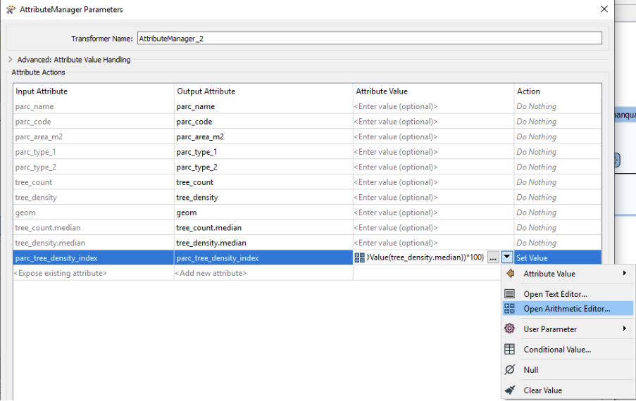

3. Appliquer cette formule aux variables :  
   - **tree_count** (nombre d’arbres).  
   - **tree_density** (densité d’arbres).

4. Vérifier les résultats pour assurer leur cohérence.

---

##

---
### 🧹 **Étape 11 : Nettoyage des données**
**Pourquoi ?**  
👉 Un nettoyage rigoureux garantit une base de données uniforme et fiable, en remplaçant les valeurs vides ou incorrectes par des valeurs nulles pour éviter les incohérences.

1. Ajouter un **NullAttributeManager** au flux de travail.

2. Configurer le transformer pour :  
   - Identifier les attributs vides ou contenant des caractères spéciaux.  
   - Remplacer ces valeurs par **NULL**.

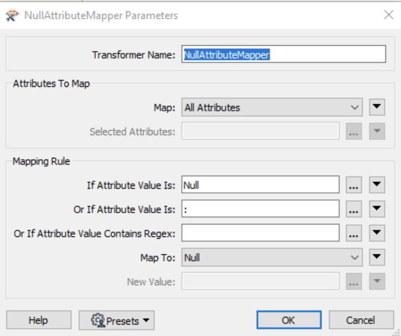

3. Vérifier que toutes les données problématiques sont correctement traitées avant l’étape suivante.

---

### 💾 **Étape 12 : Exportation des résultats**
**Pourquoi ?**  
👉 Exporter les résultats dans une base de données centralisée (PostGIS) permet de les partager, de les sauvegarder et de les visualiser facilement dans d'autres outils comme QGIS.

1. Enregistrer les résultats dans une base de données **PostGIS**.
2. Paramètres de connexion :
   - **Host** : `geo7630h25.cvwywmuc8u6v.us-east-1.rds.amazonaws.com`
   - **Port** : `5432`
   - **Database** : `geo7630`
   - **Schéma** : votre code permanent.
3. Activer **Create GIST Index** et configurer le type spatial sur **Geometry**.

---

### 🌍 **Étape 13 : Visualisation des résultats**

1. Ouvrir la table dans QGIS pour vérifier que tout est OK
2. Appliquez-y un style et sauvegarder ce style dans la BD comme vu dans les précédents laboratoires.

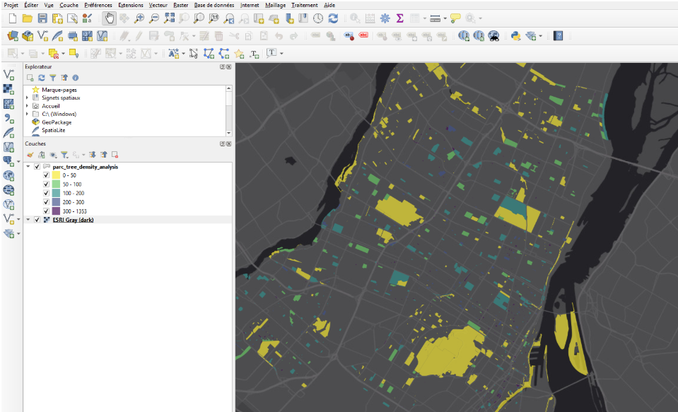

## 🔳 **Analyse de la densité arboricole avec une grille H3**

### 🛠 **Étape 1 : Création d’une grille hexagonale**
**Pourquoi ?**  
👉 Les grilles H3 permettent une analyse uniforme et adaptable grâce à leurs cellules hexagonales, idéales pour comparer des zones géographiques.

1. Connecter les données des parcs à un **H3HexagonalIndexer**.
2. Configurer la taille des hexagones.

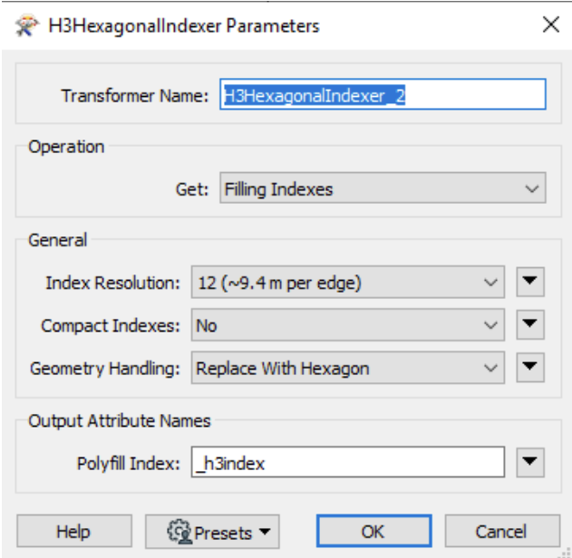

---

---
### 🛠 **Étape 2 : Dissolution des indexes H3**
**Pourquoi ?**  
👉 Lorsque chaque arbre génère un hexagone individuel avec le **H3HexagonalIndexer**, il est nécessaire de fusionner ces hexagones par numéro d’index pour obtenir une représentation unique par cellule H3, facilitant l’analyse et l’interprétation.

1. Ajouter un **Dissolver** au flux de travail.

2. Configurer le transformer pour regrouper tous les hexagones ayant le même **H3Index** en un seul.

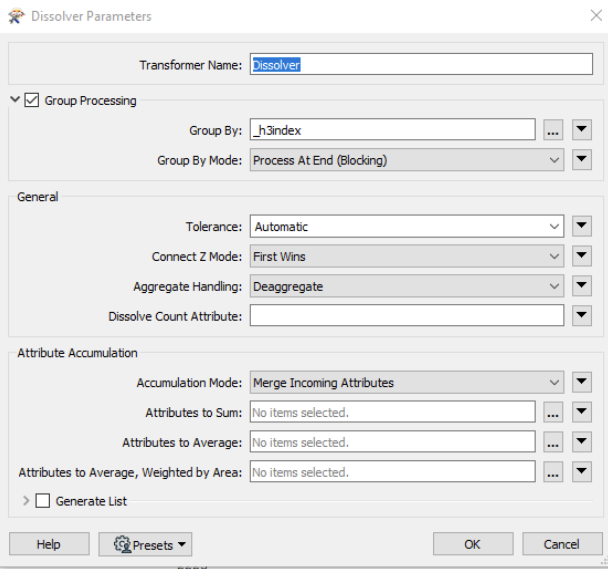

3. Vérifier le résultat pour s'assurer qu’il ne reste qu’un hexagone par index H3 dans la couche finale.

---

### 🌍 **Étape 3 : Reprojection des données**
**Pourquoi ?**  
👉 Le hexagonalindexer génère des données en 4326 il faut donc reprojeter de 4326 à 32188

1. Reprojeter les couches de données (arbres et parcs) en **EPSG:32188**.
2. Utiliser le transformer **ESRIReprojector** dans FME.

### 📌 **Étape 4 : Calcul des arbres par hexagone**
**Pourquoi ?**  
👉 Cette étape quantifie les arbres dans chaque cellule hexagonale pour identifier les zones sur ou sous-représentées.

1. Effectuer une jointure spatiale pour compter les arbres par hexagone (**PointOnAreaOverlayer**).
2. Dissoudre les hexagones avec **Dissolver** pour simplifier les données.

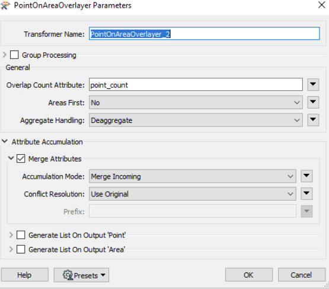

---
### 🧹 **Étape 5 : Sélection des attributs désirés**
**Pourquoi ?**  
👉 Réduire les données aux seuls attributs nécessaires (par exemple : **point_count**, **geometry**, **h3index**) permet de simplifier la couche finale et d’éviter d’inclure des informations superflues dans l’analyse ou l’exportation.

1. Ajouter un **AttributeKeeper** au flux de travail.

2. Configurer le transformer pour conserver uniquement les attributs suivants :  
   - **point_count** : Nombre d’arbres.  
   - **geometry** : La géométrie de l’hexagone.  
   - **h3index** : L’identifiant de l’hexagone H3.

3. Valider que seuls ces attributs sont présents dans la couche finale.

---

### ✏️ **Étape 6 : Renommer les champs pour l’exportation**
**Pourquoi ?**  
👉 Renommer les attributs facilite leur compréhension et leur intégration dans la base de données, en leur attribuant des noms clairs et cohérents.

1. Ajouter un **AttributeManager** au flux de travail.

2. Renommer les champs sélectionnés avec des noms explicites, par exemple :  
   - **point_count** → **tree_count**  
   - **geometry** → **geom**  
   - **h3index** → **hex_index**

3. Vérifier que les noms des champs sont clairs et alignés avec les conventions de la base de données.

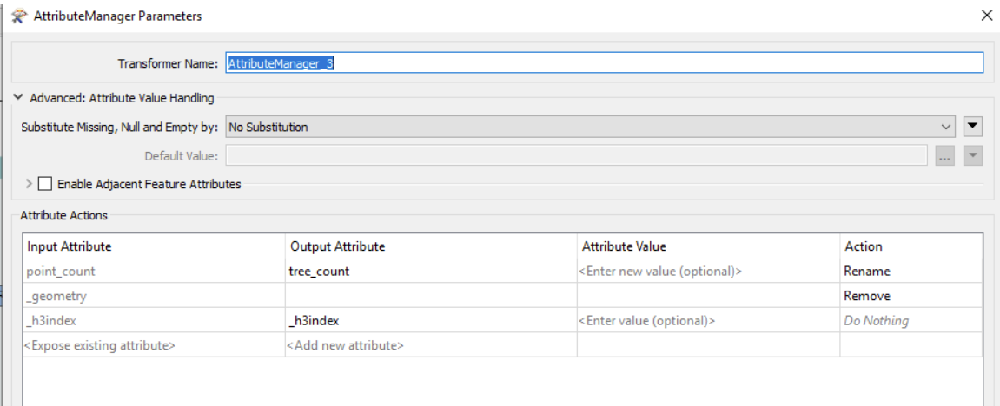

---

### 💾 **Étape 7 : Exportation dans PostGIS**
**Pourquoi ?**  
👉 Stocker les données dans PostGIS garantit leur pérennité et facilite les visualisations avancées dans des outils SIG.

1. Exporter la grille H3 dans la base de données.

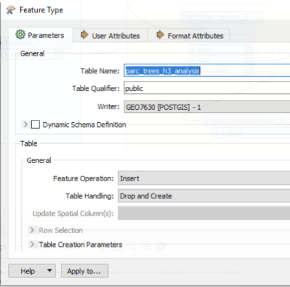

---

### 💾 **Étape 8 : Visualisez et stylisez votre grille hexagonale**
**Pourquoi ?**  
👉 Visualiser et styliser la grille hexagonale permet de comprendre et interpréter les résultats de manière claire et intuitive. Une bonne stylisation met en évidence les zones d'intérêt, facilite l'analyse visuelle et améliore la communication des résultats.

1. Charger la couche hexagonale dans **QGIS**.

2. Appliquer un style approprié pour représenter les valeurs clés (par exemple : densité d’arbres ou nombre d’arbres par hexagone).

3. Enregistrer le style dans la base de données

---

🎉 **Félicitations pour avoir complété le laboratoire !** 🎉

Vous avez brillamment navigué à travers des concepts avancés d’analyse spatiale, de traitement de données géospatiales et de visualisation. Votre capacité à manipuler des outils comme FME et QGIS témoigne de vos compétences croissantes en géomatique.

💪 Vous avez appris à :
- Acquérir et traiter des données géospatiales.
- Réaliser des jointures spatiales et des calculs complexes.
- Visualiser des résultats avec style et clarté.

🚀 Continuez sur cette lancée et appliquez ces compétences à votre TP2. 

