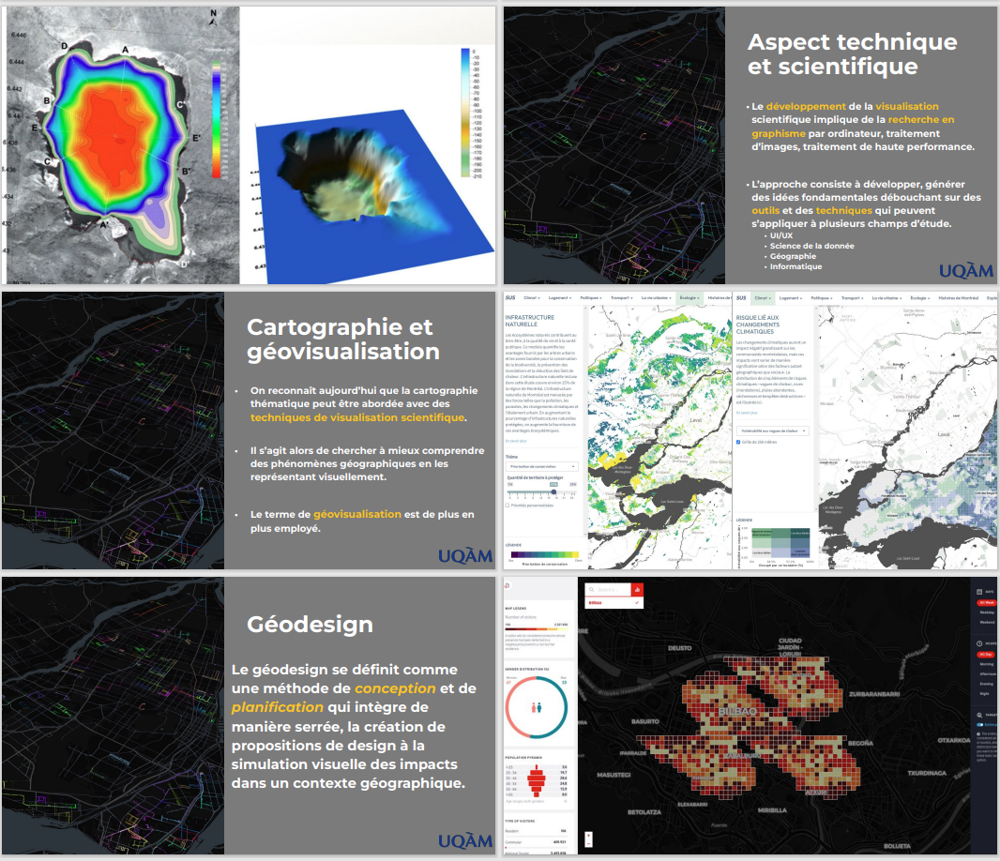
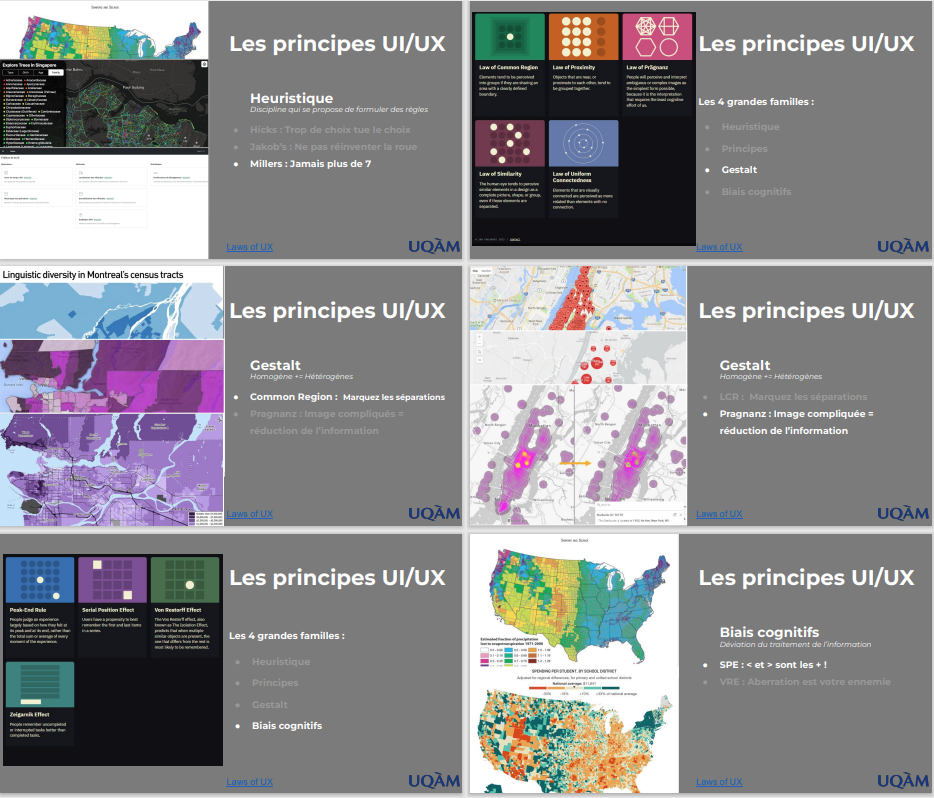
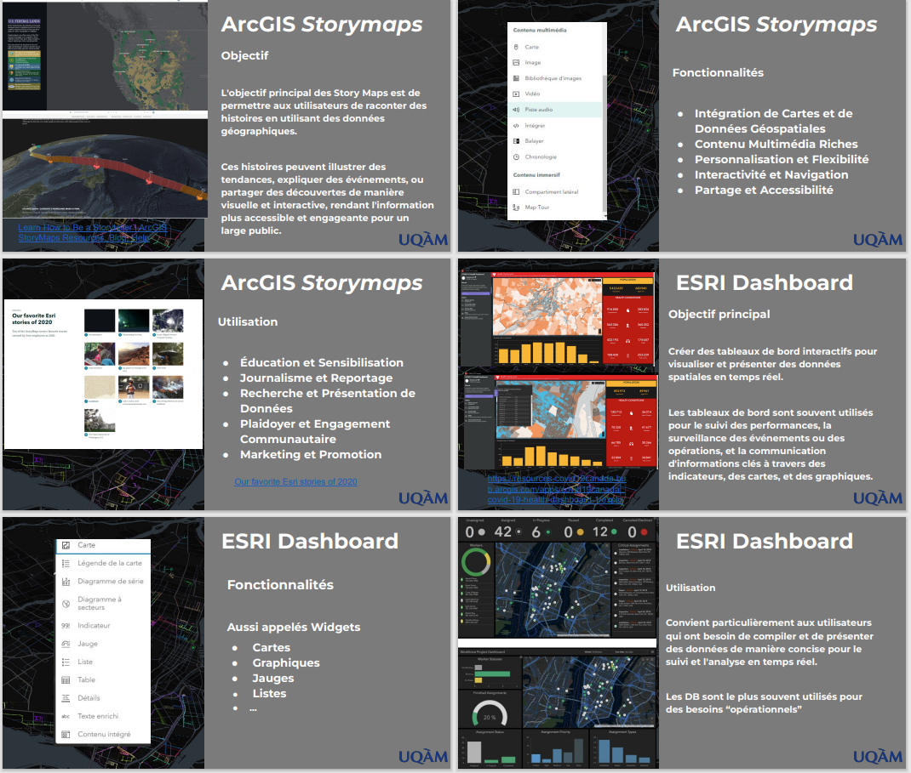
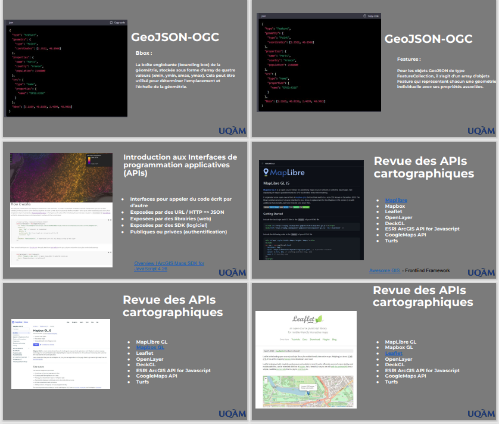
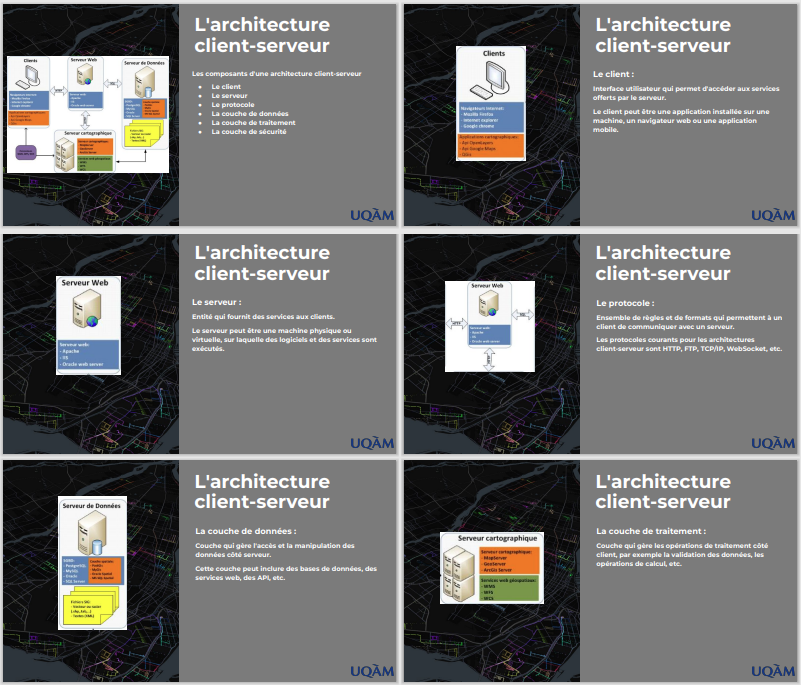
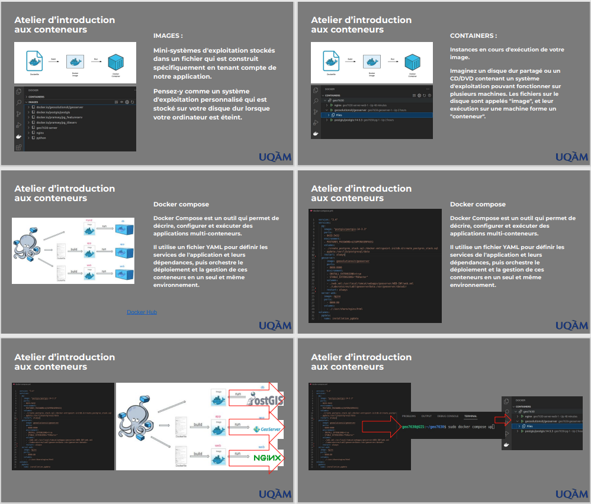

# 🗺️🖥️🌐 GEO 7630 - Intégration et visualisation des données géographiques

## 📅 Horaire
- **Cours** : Mardi 17h30 - 20h30 (A-4160)
- **Laboratoire** : Mardi 20h30 - 22h30 (A-4160)

## 👨‍🏫 Chargé de cours
- **Clément Glogowski**  
  Email : [glogowski.clement@uqam.ca](mailto:glogowski.clement@uqam.ca)

## 👨‍🔬 Démonstrateur
- **---**  
  Email : 

## 📝 Description du cours

Méthodes d'intégration de données cartographiques numériques et de données de télédétection, présentation combinée. Production de cartes, cartes-images, animations et autres documents de visualisation du territoire, dans une optique de visualisation, en s'appuyant sur des notions de perception visuelle et sur l'approche **«communication»** en cartographie.

Présentation de données en deux et trois dimensions, ainsi que des modèles altimétriques. Apprentissage des outils permettant d'exploiter au maximum les possibilités de représentation graphique offertes par les méthodes nouvelles et traditionnelles de visualisation de données géoréférencées.

Le cours approfondit également les diverses formes de représentation adaptées aux données à référence spatiale dans le web. Les principes de **sémiologie graphique** seront abordés afin de choisir les bonnes représentations pour les données requises. Ce cours comporte une part importante de **travaux pratiques**.

---

## 🎯 Objectifs spécifiques

1. Approfondir les aspects de **publication cartographique sur Internet** en tenant compte des avancées technologiques.
2. Maîtriser les concepts et techniques d'**ETL**.
3. Visualiser et modéliser les données **2D et 3D**.
4. Comprendre les processus de publication cartographique en milieu organisationnel.
5. Comprendre et appliquer les bonnes pratiques d'**UI/UX**.
6. Concevoir et réaliser un site web en géomatique avec des bases en programmation applicative : **HTML, CSS, JavaScript, API, Git**.
7. Introduction à l'architecture d'une application web.

---

## 🛠️ Logiciels et bibliothèques utilisés

### **Outils ETL**
- FME
- GDAL

### **Visualisation 2D et 3D**
- QGIS / ArcGIS Pro
- Cloud Compare
- MapLibreGL
- TurfJS
- Potree / Itowns / Cesium

### **Serveurs cartographiques**
- GeoServer
- PostgreSQL + PostGIS
- Pg_featureserv, Pg_tileserv

### **Infrastructure technologique / T.I**
- Docker
- GitHub
- Visual Studio

---

## 📅 Structure du cours et calendrier

| **Date**            | **Thème**                                                 | **Évaluation / TP**                   |
|---------------------|----------------------------------------------------------|--------------------------------------|
| **7 janvier 2025**  | Introduction, plan de cours, TP1                         | Présentation TP1                     |
| **14 janvier 2025** | Perception visuelle, UI/UX, animations                   | Accompagnement TP1                   |
| **21 janvier 2025** | Visualisation des données vectorielles 2D               | Nettoyage, projection, visualisation |
| **28 janvier 2025** | Visualisation des données matricielles                  | **TP1 Dû**  et Accompagnement TP2                   |
| **4 février 2025**  | Données LiDAR et visualisation 3D (Jakarto, terrain)     | Visualisation 3D                     |
| **11 février 2025** | ArcGIS Online : Sémiologie, UI/UX                       | Création d'une webmap                |
| **18 février 2025** | ArcGIS Online : Dashboards, Experience Builder          | TP2 en progression                   |
| **25 février 2025** | Examen intra                                            |                         |
| **4 mars 2025**     | Relâche                                                 | -                                    |
| **11 mars 2025**    | Webmapping open source : OGC, GeoServer, PostGIS        | Diffusion de données  **TP2 Dû**                 |
| **18 mars 2025**    | Webmapping (Front-end) : HTML, CSS, JS, API             | Développement cartographique         |
| **25 mars 2025**    | Webmapping (Back-end) : Docker, PostgreSQL/PostGIS      | Développement intermédiaire          |
| **1 avril 2025**    | Concepts avancés de webmapping  pt1                     | Visualisation avancée                |
| **8 avril 2025**    | Concepts avancés de webmapping pt2                      | Préparation à la mise en production |
| **15 avril 2025**   | Révisions et aide au TP3                                |                               |
| **22 avril 2025**   | Examen final                                            | Évaluation finale  **TP3 Dû**                        |

---

## 📅 Sommaire des cours

### **Cours 1 : Introduction au cours et notions fondamentales**
- **Thèmes abordés** :
  - Présentation du plan de cours et des objectifs.
  - Notions fondamentales de **visualisation de données géographiques**.
  - Introduction aux composantes **temporelles, spatiales, qualitatives et quantitatives**.
- **Travail associé** : Identification d'une problématique pour le TP1.

### **Cours 2 : Perception visuelle et principes UI/UX**
- **Thèmes abordés** :
  - Principes de **perception visuelle** pour la cartographie.
  - Introduction à l'UI/UX (User Interface / User Experience).
  - Application des lois de l'UX (Occam, Postel, Miller, etc.).
- **Travail associé** : Création de visualisations simples respectant les principes UI/UX.

### **Cours 3 : Intégration et visualisation des données vectorielles**
- **Thèmes abordés** :
  - Introduction aux **données vectorielles** (points, lignes, polygones).
  - Utilisation des **tuiles vectorielles** pour des cartes interactives.
  - Validation et nettoyage des données.
- **Travail associé** : Manipulation des données vectorielles dans FME.

### **Cours 4 : Intégration et visualisation des données matricielles**
- **Thèmes abordés** :
  - Concepts des **données matricielles** (rasters).
  - Opérations de mosaïcage, resampling, et masking.
  - Visualisation des rasters : Hillshading, Color Mapping.
- **Travail associé** : Visualisation d'images aériennes et création de rasters dans QGIS.

### **Cours 5 : Intégration et visualisation des données 3D**
- **Thèmes abordés** :
  - Introduction aux données **LiDAR** et modèles 3D.
  - Techniques de modélisation de surface (TIN, interpolation).
  - Visualisation des nuages de points et bâtiments 3D.
- **Travail associé** : Création de modèles 3D interactifs.

### **Cours 6 : Visualisation avec ArcGIS Online**
- **Thèmes abordés** :
  - Utilisation de **ArcGIS Online** pour publier des cartes.
  - Création de dashboards et visualisations interactives.
  - Sémiologie graphique dans ArcGIS.
- **Travail associé** : Création de services cartographiques avec ArcGIS Online.

### **Cours 7 : Intégration avancée et développement d’applications**
- **Thèmes abordés** :
  - **ArcGIS Story Maps** et **Experience Builder**.
  - Intégration des services via **REST API**.
  - Introduction à l'**ArcGIS Maps SDK for JavaScript**.
- **Travail associé** : Développement d’une application interactive simple.

### **Cours 8 : Webmapping Front-End - HTML, CSS et JavaScript**
- **Thèmes abordés** :
  - Bases de **HTML/CSS** pour structurer et styliser une page.
  - Introduction à **JavaScript** pour les interactions.
  - Utilisation des APIs comme MapLibreGL pour le webmapping.
- **Travail associé** : Création d’une carte interactive avec JavaScript.

### **Cours 9-10 : Architectures et services géospatiaux backend**
- **Thèmes abordés** :
  - Architecture client-serveur.
  - Introduction à **PostGIS**, **pg_tileserv** et **pg_featureserv**.
  - Publication des données via GeoServer.
- **Travail associé** : Configuration d’un environnement Docker et publication de services.

### **Cours 11-12 : Analyse spatiale et conteneurisation**
- **Thèmes abordés** :
  - Analyse spatiale (buffer, distance, intersect) avec **TurfJS**.
  - Mise en place de **conteneurs Docker** pour l’application backend.
  - Utilisation de **GDAL** pour les flux ETL/ELT.
- **Travail associé** : Analyse et conteneurisation des traitements ETL.

### **Cours 13 : Visualisation 3D avec 3D Tiles**
- **Thèmes abordés** :
  - Introduction aux **3D Tiles** pour le rendu 3D sur le web.
  - Utilisation d'outils comme **Itowns** et **CesiumJS**.
  - Techniques d’optimisation pour le streaming des modèles 3D.
- **Travail associé** : Création d’une scène interactive avec des données 3D.

### **Cours 14 : Mise en production d'une application webmapping**
- **Thèmes abordés** :
  - Bonnes pratiques pour la **mise en production**.
  - Publication, assurance qualité, et stratégies de déploiement.
  - Contribution open source et gestion du code avec **GitHub**.
- **Travail associé** : Préparation finale et déploiement de l’application webmapping.

---

## 📊 Évaluations

| **Travail/Examen**                     | **Pondération** | **Échéance**         |
|----------------------------------------|-----------------|----------------------|
| **TP1** - Problématique et données     | 5%              | 28 janvier 2025      |
| **TP2** - Intégration vectorielle      | 15%             | 11 mars 2025          |
| **TP3** - Développement app web        | 20%             | 15 avril 2025        |
| **Examen intra**                       | 20%             | 4 mars 2025          |
| **Examen final**                       | 20%             | 15 avril 2025        |
| **Laboratoires**                       | 20%             | 15 avril 2025        |
---

## Précisions sur les travaux pratiques (1–3)

Les travaux pratiques représentent les trois étapes d’un travail global : 
- Identification de la problématique et des données sources.
- Intégration et modélisation des données.
- Visualisation et diffusion des données.

## 📋 Barème de conversion des notes du Département de Géographie (2ème Cycle)

| Note  | Pourcentage   |
|-------|---------------|
| A+    | 90 à 100 %    |
| A     | 85 à 89 %     |
| A-    | 80 à 84 %     |
| B+    | 77 à 79 %     |
| B     | 73 à 76 %     |
| B-    | 70 à 72 %     |
| C+    | 67 à 69 %     |
| C     | 63 à 66 %     |
| E     | 0 à 62 %      |

Pour plus d’informations sur les autres règlements et politiques de l’UQAM : http://www.instances.uqam.ca/reglements/titre.html

## Précisions sur les travaux :

Respect de la ponctualité au niveau de la remise des travaux : 
- Les travaux sont exigés à des dates précises (voir la section "Contenu et calendrier des activités" ci-dessous). 
- Une pénalité de 5 % par jour pour retard non justifié sera mise en application [Exemple : Soit un travail pratique noté sur 25 points, un retard d’un jour implique une pénalité de 1,45 point (c’est-à-dire 25 points X 0,05 X 1 jour = 1,45 point), un retard de deux (2) jours, une pénalité de 2,90 points (25 points X 0,05 X 2 jours = 2,90 points), etc.].

## Précisions sur les périodes de laboratoire :

- Les périodes de laboratoire, sous la supervision d'un démonstrateur, permettront aux étudiants, à l’aide de démonstrations et l’utilisation de logiciels appropriés, d’être en mesure de bien connaître, utiliser et appliquer les outils de traitement de l’information et de cartographie.

- Chaque période de laboratoire sera accompagnée d'une méthode d'évaluation. 

## Précisions sur les invités et sorties de terrain :

- Un ou plusieurs invités pourront venir étoffer le cours en venant proposer des présentations et ou des démonstrations durant la session, il se peut qu’une heure de cours ou de laboratoire soit retranchée pour les invités.

- Néanmoins toute la matière de cette heure de cours sera rattrapée. 
- Une sortie de terrain, date à déterminer, est envisagée durant la session pour assister à un “GeoMeetUp” cette sortie de terrain se déroulera sur les heures de cours. - Néanmoins toute la matière du cours sera rattrapée. 

## 📚 Notes et documentation

Les présentations seront disponibles sur **GitHub**.
Les références bibliographiques et ressources additionnelles seront ajoutées dans chaque capsule de cours.

---

## 📜 Bonnes pratiques

- Respecter les consignes de **remise des travaux**.
- Assurer une **intégrité académique** : mentionner vos sources et citer correctement les outils utilisés.
- Ne pas hésiter à **demander de l'aide rapidement**.
- Assurer vous de mettre un effort constant et de planifier à l'avance vos sessions de travail (+-7h par semaine)
- Je vous encourage à **partager vos liens et trouvailles** dans le **TEAMS du cours** pour en faire bénéficier les autres personnes inscrites. 

---

# 📚 Intelligence artificielle et agent conversationnel

L’intelligence artificielle et les agents conversationnels de type **« ChatGPT »** sont maintenant assez performants et diversifiés pour être utilisés dans le cadre universitaire. Il est de la responsabilité de chaque personne d’en connaître les **forces et les faiblesses**. Il devient également primordial de développer des compétences spécifiques pour mieux les utiliser dans différents contextes (notamment apprendre à faire des requêtes). C’est pour cette raison que dans le cadre de ce cours, vous êtes **autorisés et même encouragés** à utiliser ces outils dans le cadre de vos travaux.

Cette utilisation représente une opportunité de vous familiariser et développer vos compétences pour mieux les exploiter. Un éventail diversifié d’outils est à votre disposition pour vous guider et vous aider à mieux les comprendre. Je vous invite donc à consulter les différentes ressources disponibles à l’UQAM, mais également ailleurs pour vous aider dans l’utilisation de ces outils. Voici quelques liens utiles :

- [Site de la bibliothèque (très complet)](https://uqam-ca.libguides.com/ChatGPT_et_IA/Accueil) : Prenez le temps de le lire au complet.
- [Guide de l’étudiant préparé par le carrefour technopédagogique de l’UQAM](https://services-medias.uqam.ca/media/uploads/sites/44/2023/10/18101032/Guide_PersonneEtudiante_UsageResponsableIA.pdf)

---

## 📝 Citer ChatGPT (ou autre agent conversationnel) dans vos travaux

Pour respecter les **politiques universitaires sur l’intégrité académique**, il est important de bien citer **ChatGPT** et de contextualiser son utilisation dans le cadre de vos travaux. Il est donc de votre responsabilité d’inclure :

1. **Les citations et références** :
   - Ajoutez une référence formelle dans votre bibliographie (selon les normes APA).
   - Fournissez le **lien URL de votre conversation**.

2. **Le contexte d’utilisation** :
   - Ajoutez une **note de bas de page** pour expliquer pourquoi et comment vous avez utilisé l’outil.

### Comment citer ChatGPT :
- Consultez le **guide étudiant**, qui contient une section détaillée sur la citation des outils d’intelligence artificielle.
- Regardez cette vidéo explicative : [Comment citer ChatGPT (YouTube)](https://youtu.be/5MI23O08x2I?t=96)

---

## Pour aller plus loin
- **Cours gratuit sur l’utilisation de ChatGPT** : [Catalogue Edulib - GPT 101](https://catalogue.edulib.org/fr/cours/umontreal-gpt101/)

# Politique no 2 sur la liberté académique universitaire

## Extrait de la politique no 2 sur la liberté académique universitaire, article 5.

### 5. Droit à la liberté académique universitaire

Le droit à la liberté académique universitaire est le droit de toute personne d’exercer librement et sans contrainte doctrinale, idéologique ou morale, telle la censure institutionnelle, une activité par laquelle elle contribue à l’accomplissement de la mission d’une université.

Ce droit comprend la liberté :

- **d’enseignement et de discussion** ;
- **de recherche, de création et de publication** ;
- **d’exprimer son opinion sur la société et sur une institution**, y compris l’établissement duquel la personne relève, ainsi que sur toute doctrine, tout dogme ou toute opinion ;
- **de participer librement aux activités d’organisations professionnelles ou d’organisations académiques**.

Il doit s’exercer en conformité avec les normes d’éthique et de rigueur scientifique généralement reconnues par le milieu universitaire et en tenant compte des droits des autres membres de la communauté universitaire.

---

# Politique no 42 sur le respect des personnes, la prévention et l’intervention en matière de harcèlement (extraits)

L’Université reconnaît à toutes les personnes membres de la communauté universitaire le droit d’être traitées avec dignité, équité et respect mutuel.

L’Université considère que le respect mutuel, l’égalité, l’écoute et l’entraide sont des valeurs importantes favorisant l’épanouissement personnel et l’établissement de rapports harmonieux entre les personnes et les groupes.

### Définitions

- **Harcèlement psychologique** : Une conduite vexatoire se manifestant par des comportements, des paroles, des écrits, des actes ou des gestes répétés qui sont hostiles ou non désirés et ayant pour effet de porter atteinte à la dignité ou à l’intégrité psychologique ou physique d’une personne.
  
- **Harcèlement discriminatoire** : Lié à des motifs sur lesquels il est légalement interdit de discriminer (sexe, orientation sexuelle, âge, religion, etc.).

Une seule conduite grave peut aussi constituer du harcèlement si elle produit un effet nocif continu pour une personne.

---

# Règlement no 18 sur les infractions de nature académique

Tout acte de plagiat, fraude, copiage, tricherie ou falsification de document constitue une infraction au sens de ce règlement. Pour plus d’informations, consultez le [site dédié](http://r18.uqam.ca).

---

# Politique no 16 : Prévenir et combattre le sexisme et les violences à caractère sexuel

## Article 3.2 Consentement sexuel

Le consentement sexuel doit être volontaire, libre, éclairé, clair et maintenu tout au long de l’activité sexuelle.

#### Absence de consentement
- La personne est incapable de le formuler (inconscience, intoxication, etc.).
- La personne exprime une absence d’accord par ses paroles ou comportements.
- La personne consent sous l’effet de la crainte ou d’un abus de pouvoir.

---

## Article 3.18 Violences à caractère sexuel

Les violences à caractère sexuel incluent :
- Avances verbales ou non verbales non désirées ;
- Cyberharcèlement sexuel ;
- Diffusion d’images sexuelles sans consentement ;
- Agression sexuelle ou menace d’agression.

Pour plus d’information, consultez la [Politique no 16](https://instances.uqam.ca/wp-content/uploads/sites/47/2019/04/Politique_no_16_2.pdf).

---

# Soutien et ressources

- **Bureau d’intervention et de prévention en matière de harcèlement (BIPH)** :  
  Téléphone : 514 987-3000, poste 0886  
  Courriel : [harcelement@uqam.ca](mailto:harcelement@uqam.ca)

- **Soutien psychologique (Services à la vie étudiante)** :  
  Téléphone : 514 987-3185  
  [Site web](http://vie-etudiante.uqam.ca/)

- **Service de la prévention et de la sécurité** :  
  Téléphone : 514 987-3131

**🎓 Bon apprentissage et bonne session ! 🚀**
