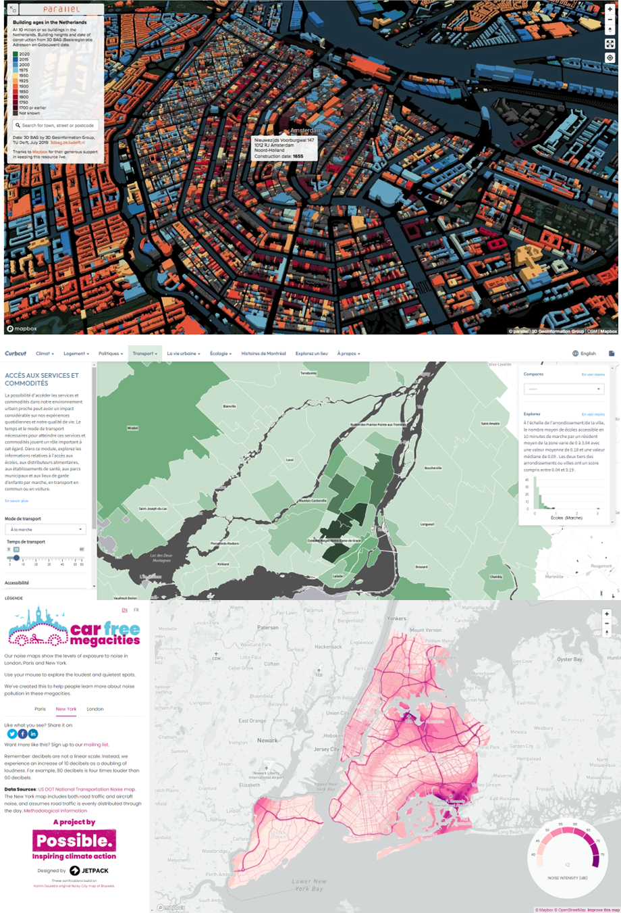

# 📚 GEO 7630 - TP1 : Identification de la problématique et acquisition des données

## 🗓️ Date de remise
- **Dimanche 25 janvier 2025 à 17h**

## 🎯 Objectif du TP1
Ce premier travail pratique vise à :
1. **Identifier une problématique** de travail qui servira de fil conducteur pour la session.
2. **Acquérir et organiser les données sources** nécessaires pour les futures analyses.
3. **Développer des compétences dans la recherche** de données géospatiales pertinentes et leur documentation.
4. **Commencer à maitriser l'outil central du cours : Github**

---

## 📝 Instructions générales

### **1. Identification de la problématique de travail**
La problématique choisie doit :
- Correspondre à un ou plusieurs des thèmes suivants :
  - **Économie et entreprises**
  - **Éducation et recherche**
  - **Environnement, ressources naturelles et énergie**
  - **Gouvernement et finances**
  - **Infrastructures**
  - **Loi, justice et sécurité publique**
  - **Politiques sociales**
  - **Santé**
  - **Société et culture**
  - **Tourisme, sports et loisirs**
  - **Transport**
- Contenir les éléments suivants :
  - [ ] **Une composante temporelle** : période d’analyse.
  - [ ] **Une composante spatiale** : localisation précise des données.
  - [ ] **Des composantes qualitatives** (ex. codes postaux, qualité de l'air).
  - [ ] **Des composantes quantitatives** (ex. nombre d’habitants, fréquentation).
  - [ ] **Une composante analytique** combinant qualitatif et quantitatif (ex. pourcentage d’utilisation des pistes cyclables par secteur).
- Être accompagnée d’un texte explicatif de **+/- 350 mots** comprenant :
  - L’**orientation générale** de la problématique.
  - Les **analyses prévues**.
  - Les **types de visualisation ou d’application** envisagés.
  - L’**intérêt** potentiel d’un tel tableau de bord.

---

### **2. Acquisition des données sources**
Les données requises pour votre problématique doivent inclure :
- [ ] **Une ou plusieurs images aériennes** (format libre).
- [ ] **Données vectorielles qualitatives** (ex. limites administratives).
- [ ] **Données vectorielles quantitatives** (ex. statistiques par secteur).
- [ ] **Données vectorielles avec une variable 3D** (ex. bâtiments avec hauteur, arbres).

#### **Sources recommandées**
- **Portail des données ouvertes de la Ville de Montréal** : [Données Montréal](https://donnees.montreal.ca/)

---

## Exemples de réalisation

## 📑 Matériel à rendre
Un dépot **Github** contenant :
1. **Description explicative** de votre problématique (350 mots) incluant :
   - Orientation générale de votre travail de session
   - Analyses spatiales prévues à haut niveau.
   - Types de visualisation envisagées.
   - Intérêt du tableau de bord, c'est à dire à quoi va servir votre travail.
2. **Sources des données** :
   - Liens vers les jeux de données du **portail des données ouvertes de Montréal**.
   - Références des problématiques abordées.

---

## 🧾 Grille d’évaluation
| Critère                                | Pondération   |
|---------------------------------------|--------------:|
| **Choix du thème et de la problématique**   | 50%          |
| **Choix et respect des jeux de données** | 50%          |

### **Détails des critères**
- **Thème et problématique** : Originalité et pertinence du choix.
- **Jeux de données** : Respect des composantes (temporelle, spatiale, qualitative, quantitative).
- **Qualité des données** : Cohérence et complexité des sources sélectionnées.
- **Niveau de complexité** :
  - **Facile (5%)** : Analyse simple, non jointe.
  - **Moyen (7.5%)** : Jointure spatiale simple.
  - **Difficile (15%)** : Intersection ou jointure multicritère.

---

## 🚀 Conseils
1. **Sélectionnez une problématique précise** avec un potentiel analytique clair.
2. **Validez vos jeux de données** pour qu’ils respectent les exigences.
3. **Documentez vos sources et votre réflexion** de manière rigoureuse.

---

**Bonne chance pour ce premier travail pratique !**

## 📂 Sujets exemples

### **Agriculture et Alimentation**
- **Focus** : Examiner les pratiques d'agriculture urbaine, les politiques alimentaires, et les habitudes de consommation.
- **Tâches** :
  - Cartographier les jardins communautaires, fermes urbaines, et marchés locaux.
  - Analyser l'impact de l'agriculture urbaine sur la sécurité alimentaire et la durabilité.
  - Étudier les initiatives de réduction des déchets alimentaires et de promotion de l'alimentation durable.

### **Économie et Entreprises**
- **Focus** : Analyser le tissu économique, les zones d'affaires, et le climat entrepreneurial.
- **Tâches** :
  - Identifier les principaux quartiers d'affaires et les pôles d'innovation.
  - Évaluer l'impact des politiques économiques locales sur les PME et startups.
  - Analyser les tendances du marché de l'emploi et les secteurs économiques en croissance.

### **Éducation et Recherche**
- **Focus** : Cartographier les infrastructures éducatives et de recherche, et évaluer leur accessibilité et qualité.
- **Tâches** :
  - Localiser les écoles, universités et centres de recherche.
  - Étudier la répartition géographique des ressources éducatives et son impact sur l'équité.
  - Analyser les initiatives et programmes éducatifs innovants.

### **Environnement, Ressources Naturelles et Énergie**
- **Focus** : Évaluer la gestion des espaces verts, des ressources naturelles et des politiques énergétiques.
- **Tâches** :
  - Cartographier les parcs, réserves naturelles et installations énergétiques.
  - Analyser les politiques de gestion de l'eau et des ressources naturelles.
  - Évaluer les initiatives en matière d'énergies renouvelables et de réduction des émissions.

### **Gouvernement et Finances**
- **Focus** : Examiner le fonctionnement des institutions gouvernementales et l'allocation des ressources financières.
- **Tâches** :
  - Localiser les bâtiments gouvernementaux et analyser leur accessibilité pour les citoyens.
  - Étudier le budget de la ville, la répartition des dépenses et les investissements.
  - Analyser l'impact des politiques fiscales et financières sur différents secteurs.

### **Infrastructures**
- **Focus** : Analyser l'état et la distribution des infrastructures essentielles.
- **Tâches** :
  - Cartographier les hôpitaux, écoles et services publics.
  - Évaluer l'état des infrastructures et identifier les besoins de rénovation ou de développement.
  - Analyser l'impact des projets d'infrastructures sur la vie urbaine.

### **Loi, Justice et Sécurité Publique**
- **Focus** : Évaluer les services de loi et de sécurité, et leur impact sur la communauté.
- **Tâches** :
  - Localiser les postes de police, tribunaux et centres de détention.
  - Analyser les statistiques de criminalité et l'efficacité des services de sécurité.
  - Étudier les initiatives de prévention de la criminalité et de réhabilitation.

### **Politiques Sociales**
- **Focus** : Examiner les programmes sociaux et leur efficacité dans la lutte contre les inégalités.
- **Tâches** :
  - Cartographier les centres d'aide sociale, logements abordables et services communautaires.
  - Analyser l'impact des politiques sociales sur différentes populations.
  - Évaluer les initiatives d'intégration sociale et de lutte contre l'exclusion.

### **Santé**
- **Focus** : Analyser les infrastructures de santé et les tendances en matière de santé publique.
- **Tâches** :
  - Localiser les hôpitaux, cliniques et centres de santé.
  - Étudier les disparités d'accès aux soins de santé.
  - Analyser les initiatives de promotion de la santé et de prévention des maladies.

### **Société et Culture**
- **Focus** : Cartographier et analyser la richesse culturelle et sociale de la ville.
- **Tâches** :
  - Identifier les lieux culturels, monuments historiques et centres communautaires.
  - Analyser l'impact des événements culturels et programmes sur la cohésion sociale.
  - Étudier la diversité culturelle et son expression dans l'espace urbain.

### **Tourisme, Sports et Loisirs**
- **Focus** : Explorer l'offre touristique, les installations sportives et les options de loisirs.
- **Tâches** :
  - Cartographier les attractions touristiques, installations sportives et parcs de loisirs.
  - Analyser l'impact économique et social du tourisme et des activités de loisirs.
  - Évaluer la disponibilité et l'accessibilité des installations de loisirs pour les résidents.

### **Transport**
- **Focus** : Étudier les réseaux de transport et leur efficacité.
- **Tâches** :
  - Cartographier les réseaux de transport public et privé, y compris pistes cyclables et voies piétonnes.
  - Analyser les problèmes de circulation, connectivité et accessibilité.
  - Évaluer les initiatives de transport durable et leur impact sur la qualité de vie.

---