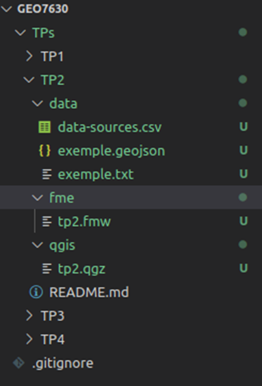
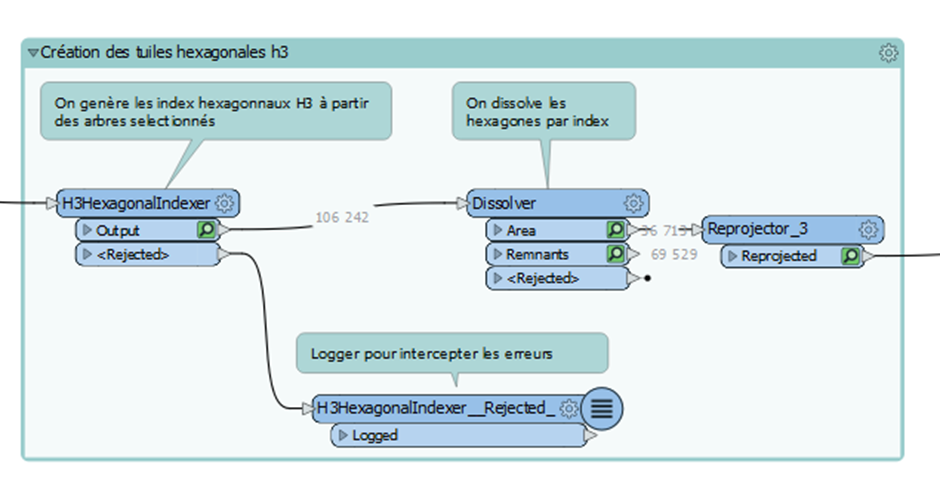
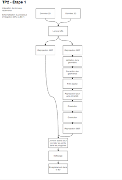

# 📚 GEO 7630 - TP2 : Intégration des données vectorielles et matricielles

## 🗓️ Date de remise
- **À préciser**

## 🎯 Objectif du TP2
L'objectif principal de ce travail est de vous familiariser avec l'outil de traitement et d'intégration **FME** (ETL/ELT) tout en préparant vos données pour les prochaines étapes de la session.

Vous devrez effectuer les étapes suivantes :
1. **Lire ou charger des données** depuis une URL, une base de données ou un fichier.
2. **Valider l'intégrité** des données entrantes.
3. **Nettoyer** les données si nécessaire.
4. **Reprojeter** les données dans le système de coordonnées EPSG:3857.
5. **Analyser et calculer** des attributs pertinents.
6. **Valider l'intégrité** des données sortantes.
7. **Intégrer les données** dans une base PostgreSQL/PostGIS.
8. **Choisir une symbologie adéquate** pour vos couches dans QGIS.
9. **Documenter le processus** dans un dépôt **GitHub** avec schéma explicatif.

---

## 📝 Prérequis pour le TP2
- **Compte GitHub**.
- **Licence étudiante FME** (disponible sur demande).
- Jeux de données requis :
  - **Images aériennes** (format libre).
  - **Données vectorielles qualitatives**.
  - **Données vectorielles quantitatives**.
  - **Nuages de points LIDAR** (optionnel, format .las).
  - **Données vectorielles avec une variable 3D** (ex. bâtiments avec hauteur).

---

## 📝 Consignes générales

### **1. Architecture du dépôt GitHub**
Votre dépôt GitHub doit respecter l'architecture suivante :
```plaintext
TP2/
├── README.md
├── tp2.fmw          # Workbench FME
├── schema/          # Schéma explicatif (draw.io ou autre)
│   └── etl_process.png
├── qgis_project/    # Projet QGIS et fichiers de style
│   └── tp2_project.qgz
├── data/            # Données d'entrée et de sortie
└── sql/             # Scripts SQL si nécessaire
```


### **2. Workbench FME**
- Toutes les opérations doivent être regroupées dans un seul fichier **tp2.fmw**.
- Le fichier doit être **structuré et annoté** :
  - Utilisez des **bookmarks** pour regrouper les processus.
  - Ajoutez des commentaires pour expliquer les transformateurs utilisés.



#### **Processus requis** :
1. **Validation des données** : Vérifiez les attributs et la géométrie.
2. **Nettoyage** : Corrigez les erreurs éventuelles (ex. géométries invalides).
3. **Reprojection** : EPSG:3857 pour toutes les données sortantes.
4. **Calculs et analyses** : Ajoutez des champs calculés si nécessaire.
5. **Intégration** : Importez les données dans une base PostgreSQL/PostGIS.

---

### **3. Schématisation du processus ETL**
- Réalisez un schéma clair et simplifié de votre processus **ETL/ELT**.
- Outil recommandé : **draw.io** ou tout autre logiciel équivalent.
- Le schéma doit être inclus dans le dossier **schema/** et dans le **README.md**.



---

### **4. Projet QGIS**
- Fournissez un fichier de projet **.qgz** avec :
  - Toutes les couches de données vectorielles et matricielles chargées depuis **PostgreSQL/PostGIS**.
  - Une **symbologie explicite** décrivant le phénomène de manière simple et vulgarisée.
- **Exigence** : Le projet doit s'ouvrir sans erreur avec les bonnes couches et la symbologie intacte.

#### **Critères de symbologie** :
- Les cartes doivent être compréhensibles par un **public non-expert**.
- Expliquer visuellement les phénomènes représentés.

---

## 📑 Documentation
- Un fichier **README.md** doit être rédigé en **Markdown** et contenir :
  - Une **description complète** du processus ETL/ELT.
  - Le **schéma explicatif**.
  - Une **description** des analyses effectuées et des choix techniques.
  - Instructions pour reproduire le processus.

---

## 🧾 Grille d'évaluation
| Critère                                               | Pondération   |
|------------------------------------------------------|--------------:|
| **Respect des consignes**                            | 10%          |
| **Exécution sans erreur du fichier FMW**             | 10%          |
| **Workbench FME structuré et annoté**                | 10%          |
| **Validation et nettoyage des données entrantes**    | 15%          |
| **Validation des données sortantes**                 | 15%          |
| **Qualité de l'analyse technique**                   | 10%          |
| **Qualité de la méthode et de la symbologie**        | 10%          |
| **Documentation et schéma explicatif**               | 10%          |
| **Projet QGIS (connexion PostGIS et symbologie)**    | 10%          |

---

## 🚀 Conseils pour réussir
1. **Organisez bien votre Workbench** : Utilisez des bookmarks et des commentaires explicatifs.
2. **Testez fréquemment votre processus** pour identifier rapidement les erreurs.
3. **Validez vos données** à chaque étape pour garantir l'intégrité des sorties.
4. **Simplifiez votre schéma ETL** pour le rendre clair et lisible.
5. **Assurez-vous que votre projet QGIS** fonctionne parfaitement sans couche manquante.

---

## 📂 Ressources utiles
- **FME** : [FME Documentation](https://docs.safe.com/)
- **QGIS** : [QGIS Documentation](https://qgis.org/en/docs/)
- **PostGIS** : [PostGIS Documentation](https://postgis.net/documentation/)
- **Markdown** : [Guide Markdown](https://www.markdownguide.org/)
- **draw.io** : [draw.io Editor](https://app.diagrams.net/)

---

**Bonne chance pour ce deuxième travail pratique !** 🚀
